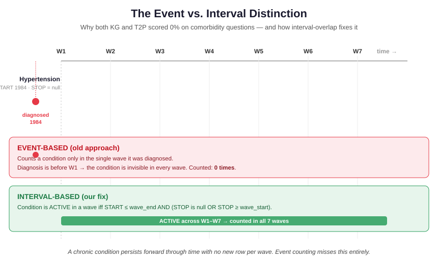
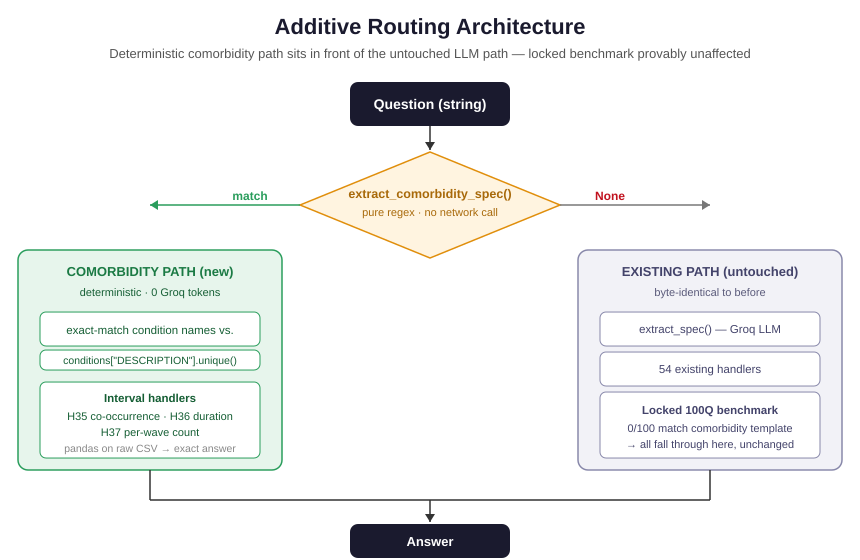
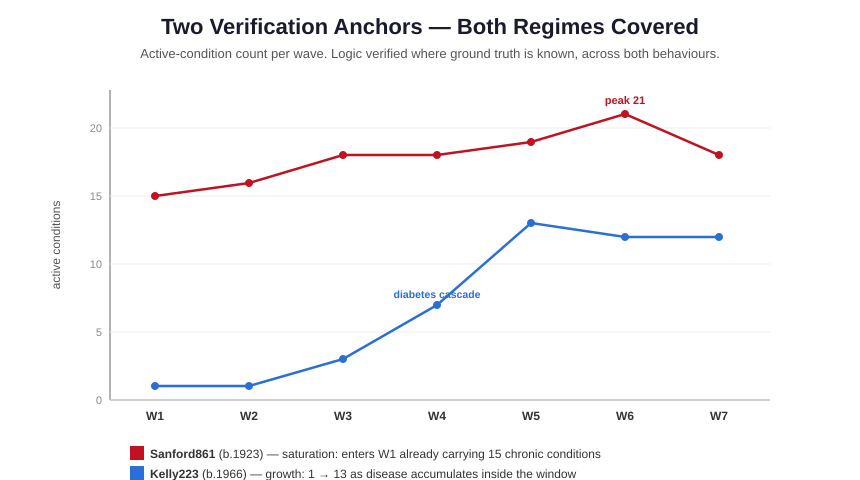
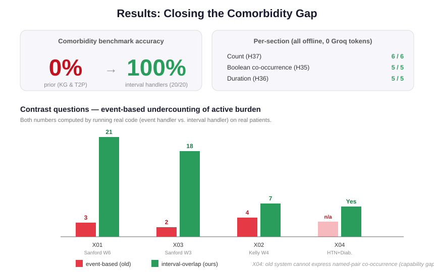

# Temporal Interval Reasoning for Longitudinal Health QA — Work Documentation

**Project:** RAG for Temporal TableQA as a Conversational AI
**Award:** Best Use Case, IASNLP Summer School 2026 (14th IIIT Advanced Summer School on NLP, IIIT-Hyderabad)
**This document covers:** the comorbidity / temporally co-active condition work completed on the `future-work` branch after the award state (`v1.0-iasnlp-award`).
**Status:** Comorbidity gap closed — 0% → 100% (20/20) on a new deterministic benchmark, verified fully offline.

---

## 1. What this work solves

The award-winning system benchmarked four architectures over longitudinal Synthea EHR data. One finding (F4) was left open: **both the Knowledge Graph and Text-to-Pandas systems scored 0% on comorbidity co-occurrence questions.** Neither could answer which conditions were *active together* within a time window.

The cause was not retrieval quality or model size — it was a **representation choice**. The prior system reasoned about conditions as *events* (a single diagnosis wave) rather than *intervals* (a span of active time). This work identifies that gap precisely, fixes it with an interval-overlap rule, and demonstrates the fix on real patients.

---

## 2. The core contribution: event vs. interval



**Figure 1.** A chronic condition (here Hypertension, diagnosed 1984 with no stop date) is a single *event* under the old approach and is counted only in its diagnosis wave — which, being before the study window, means it is counted *nowhere*. Under interval reasoning it is *active* across every overlapping wave. This is the entire mechanism behind the 0% comorbidity scores.

The fix is a single rule. A condition is **active** in a wave if and only if:

```
START ≤ wave_end   AND   (STOP is null OR STOP ≥ wave_start)
```

Everything else is built on this one predicate. Counts are taken over **distinct conditions** (`nunique`), so a patient with two separate acute episodes of the same condition is not double-counted — this was verified against a real case (Sanford861 has two Viral sinusitis episodes that correctly collapse from 20 raw rows to 19 distinct conditions).

---

## 3. Method: the interval handlers

The rule is implemented once in `active_conditions_in_wave()` and reused by four handlers:

| Handler | Question class | Example |
|---|---|---|
| H34 | co-active listing | which conditions were active in wave W |
| H35 | pairwise co-occurrence | were A and B ever active simultaneously |
| H36 | duration in waves | across how many waves was C active |
| H37 | per-wave burden count | how many conditions were co-active in wave W |

Gold answers for the benchmark are **computed by running these handlers**, never hand-typed or LLM-generated — the same trust model as the locked 100Q benchmark.

---

## 4. Architecture: additive routing



**Figure 2.** Comorbidity questions are detected and answered by a **deterministic regex router** that runs *in front of* the existing pipeline. It extracts patient, wave, and condition names by exact-matching against the real dataset vocabulary (`conditions["DESCRIPTION"].unique()`), then dispatches to the interval handlers — with **zero LLM calls**.

Two properties matter here:

- **Provable non-interference.** All 100 locked-benchmark questions return `None` from the comorbidity router (none match a comorbidity template), so every one falls through to the byte-identical original path. The regression gate is closed *by construction*, not just by observation.
- **Fail-visible extraction.** The router returns `None` on any malformed or ambiguous input rather than guessing — including a real adversarial case where a condition name (`Macular edema and retinopathy due to type 2 diabetes mellitus`) contains the delimiter word "and". This applies the project's safety principle at the extraction layer, not just the answer layer.

---

## 5. Verification: two anchors, both regimes



**Figure 3.** The logic was verified against two patients with known ground truth, chosen to cover opposite behaviours:

- **Sanford861** (born 1923) — the *saturation* regime. Enters the study window already carrying 15 chronic conditions accumulated before 1990, rising to a peak of 21 co-active in W6. Confirms pre-window chronic conditions are correctly carried forward.
- **Kelly223** (born 1966) — the *growth* regime. Accumulates disease *inside* the window (1 → 13), with a verified diabetes metabolic-cascade cluster driving the W4 jump. Confirms temporal progression is counted correctly.

A single condition (Kelly's Hypertension, diagnosed 1984, no stop) was additionally hand-traced wave by wave and matched the handler exactly across all seven waves.

---

## 6. Results



**Figure 4.** The interval handlers score **20/20** on the new comorbidity benchmark (6 count, 5 boolean, 5 duration, 4 contrast), against the prior **0%**. The run was confirmed fully offline: the Groq client was patched to raise on any call and was never invoked.

The four contrast questions quantify the event-vs-interval gap with numbers computed by running *both* the old and new code on real patients:

| Question | Event-based (old) | Interval (ours) |
|---|---|---|
| Sanford, Wave 6 | 3 | **21** |
| Sanford, Wave 3 | 2 | **18** |
| Kelly, Wave 4 | 4 | **7** |
| Kelly, HTN + Diabetes co-active | cannot express | **Yes (from W3)** |

The last row is a *capability* gap rather than a numeric error: the old system has no handler that accepts named condition pairs, so it cannot even express the query.

---

## 7. Engineering decisions worth recording

- **`nunique()` is load-bearing, not stylistic.** Counting over distinct conditions prevents recurrent acute episodes from inflating comorbidity burden. Verified on a real duplicate case. A future refactor to `len()` would silently corrupt every count.
- **Deterministic extraction over generative, for structured queries.** For a known, finite condition vocabulary, an LLM's failure mode (a plausible-but-wrong condition name) is exactly the confident-wrong-answer risk the project avoids in clinical settings. Extraction is grounded in the real vocabulary and fails visibly.
- **Additive-only changes to shared code.** The 18-line diff to `text_to_pandas_fix.py` touches no existing handler, category, or prompt — protecting the locked benchmark that shares the same router.
- **Gold answers are always computed, never authored.** The benchmark CSV is a re-runnable product of deterministic code.

---

## 8. Reproducibility — key files (on `future-work`)

| File | Role |
|---|---|
| `src/comorbidity_handlers.py` | interval-overlap rule + handlers H34–H37 |
| `src/comorbidity_router.py` | deterministic regex router + wrappers |
| `benchmark/generate_comorbidity_benchmark.py` | computes gold answers, writes the CSV |
| `benchmark/qa_pairs_comorbidity.csv` | 20-question benchmark (deterministic gold) |
| `src/eval_comorbidity.py` | offline eval runner |
| `benchmark/comorbidity_eval_results.csv` | 20/20 results |

Award state is frozen at tag `v1.0-iasnlp-award`; all work above is on `future-work`.

---

## 9. Citation seeds (for the paper's `references.bib`)

Cite as you write, not retroactively. Core set to add now:

- **Synthea** (Walonoski et al., 2018) — the dataset; must be cited.
- **RAG** (Lewis et al., 2020) — the retrieval baseline framing.
- **TempTabQA** (Gupta et al., 2023) — temporal table QA; closest neighbour to this niche.
- **Text-to-SQL / Spider** (Yu et al., 2018) — semantic-parsing anchor for the T2P framing.
- **GraphRAG** (Edge et al., 2024) — the KG-retrieval approach.
- **TAT-QA / FinQA** — table QA + numerical reasoning, for related work.
- **ELSA / HRS** cohort documentation — justification for the wave design.

Framing note for the paper: lead with *temporal interval reasoning over longitudinal health records*, not "RAG benchmark" — the interval-reasoning gap is the part new to the literature. Suggested venues: ClinicalNLP workshop or ML4H (first-author student submission).

---

## 10. Progress log entry

**[Day 1–2]** Froze award state as tag `v1.0-iasnlp-award`; opened `future-work` branch with `main` protected. Built and verified interval-overlap logic against two anchor patients (Sanford861 saturation, Kelly223 growth) plus a hand-traced single-condition persistence check. Created a 20-question comorbidity benchmark with deterministic gold answers (6 count, 5 boolean, 5 duration, 4 contrast). Wired a deterministic regex router additively into the pipeline; closed the locked-100Q regression gate by logical proof (0/100 match a comorbidity template) with zero token spend. Comorbidity eval: **20/20, fully offline**, closing the 0% gap from Finding F4. Next: local SLM spec extraction (Ollama) to remove the Groq daily-token bottleneck.